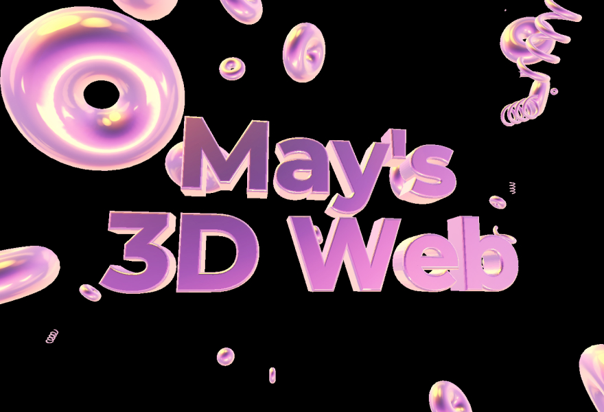

# 3D Text and Shape by Three.js

A Three JS project on playing with text and shapes.



You can check the live site here:<br>
[https://3d-text-ts.vercel.app/](https://3d-text-ts.vercel.app/)


## Getting Started

Follow these steps to set up and run the project locally.

### Prerequisites

- Node.js (https://nodejs.org) should be installed on your machine.

### Installation

1. Clone the repository to your local machine.

```bash
git clone https://github.com/mayl730/3d-text-and-shape.git
```

2. Install the dependencies using npm.

```bash
npm install
```

3. Running the Development Server
```bash
npm run dev
```

### Additional Commands
`npm run build` : Build the production-ready code in the dist folder.